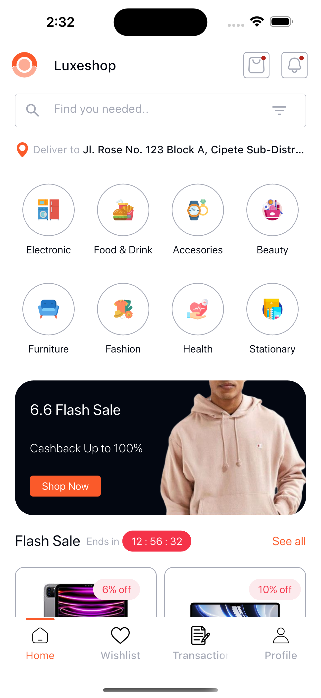
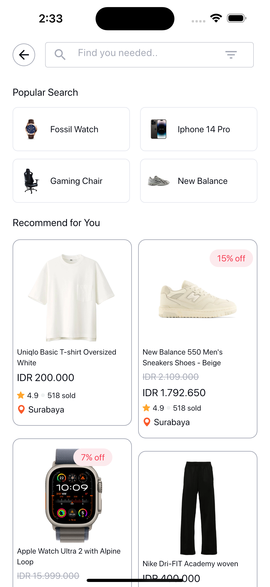
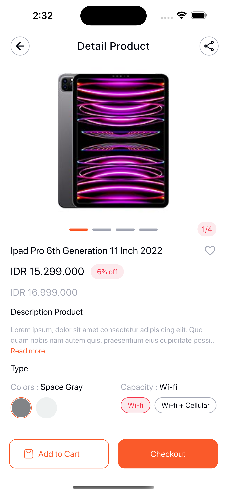
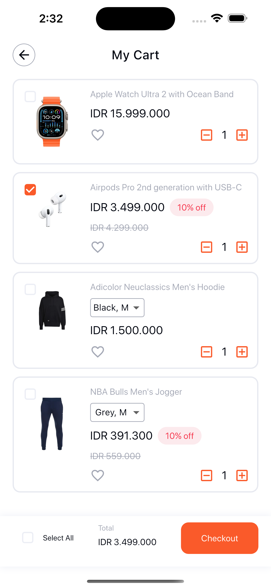
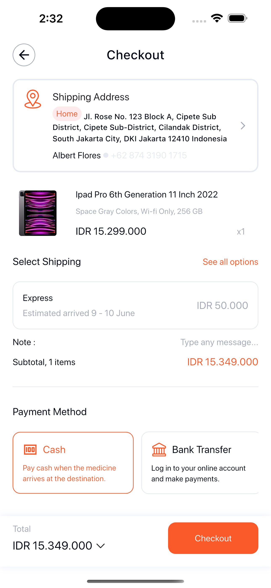
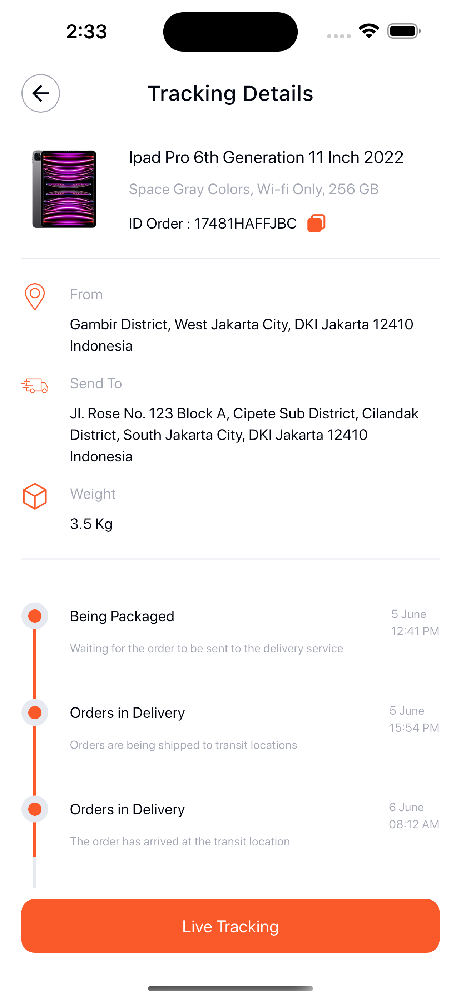

# Luxeshop

Luxeshop is a sleek and modern eCommerce mobile app UI clone designed to enhance the online shopping experience. Inspired by a stylish Dribbble shot, this app features a clean and intuitive interface that seamlessly blends aesthetics with functionality.

## 🛍️ About the Project

Luxeshop delivers a premium mobile shopping experience, making it ideal for showcasing fashion, accessories, and lifestyle products. With high-quality visuals and smooth navigation, users can effortlessly explore products and complete purchases with ease.

## 🚀 Features

- Clean and modern UI
- Inspired by a professional Dribbble design
- Smooth and responsive navigation
- High-quality product display
- Ideal for fashion and lifestyle eCommerce

## 📚 Built With

- [Flutter](https://flutter.dev/)
- [Dart](https://dart.dev/)

## ⚙️ Installation

1. Clone the repository:

   ```sh
   git clone https://github.com/DANIEL-DEMELASH/luxeshop_ui.git
   ```

2. Get packages:

   ```sh
   flutter pub get
   ```

3. Run the app:

   ```sh
   flutter run
   ```

## 📱 Screenshots

| Home Screen | Search Screen | Product Detail |
|-------------|----------------|----------------|
|  |  |  |

| Cart Screen | Checkout Screen | Track Screen |
|-------------|------------------|----------------|
|  |  |  |

## 📊 Project Status

This project is a UI clone for demonstration and portfolio purposes. Backend integration and eCommerce functionality are not included.

## 👀 Acknowledgements

Inspired by a beautiful design on [Dribbble](https://dribbble.com/shots/24409190-Luxeshop-Ecommerce-Mobile-App). All credits go to the original designer.

---
